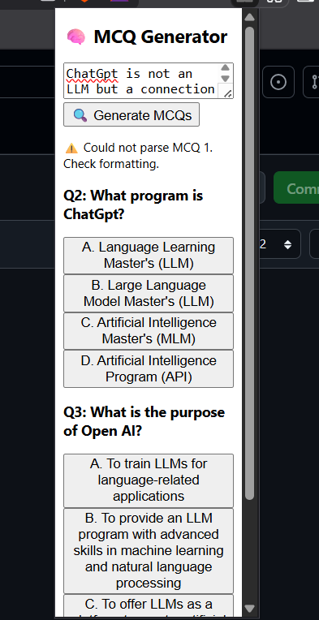

````markdown
# MCQ Generator Chrome Extension

A Chrome Extension that generates multiple-choice questions (MCQs) from selected or pasted text using a local backend.




## Features

- Generate MCQs from selected or pasted text  
- Interactive options with immediate feedback  
- Tailwind-styled popup UI  
- Runs fully on localhost  

## Requirements

- Node.js  
- Ollama (with `phi` model)

## Setup

### 1. Backend (Node + Express)

```bash
git clone https://github.com/yourusername/mcq-generator-extension
cd backend
npm install
npm start
````

Starts the backend server at `http://localhost:5000`.

### 2. Chrome Extension

1. Open `chrome://extensions`
2. Enable Developer Mode
3. Click "Load unpacked"
4. Select the `mcq-extension` folder

## File Structure

```
mcq-extension/
├── manifest.json
├── popup.html
├── popup.js
├── content.js
├── screenshot.png
```

## Example Prompt Sent to Backend

```
Q: What is the name of the pattern formed when parallel rays pass through a slit?
A. Interference
B. Reflection
C. Fraunhofer diffraction
D. Refraction
Answer: C
```

## License

MIT © \[Your Name]

```
```
